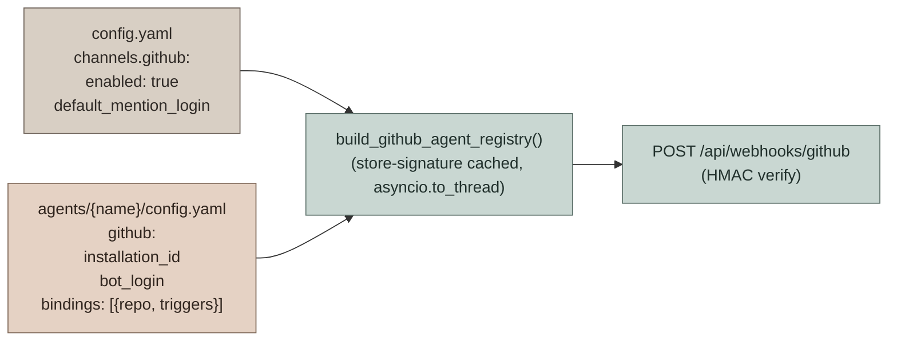
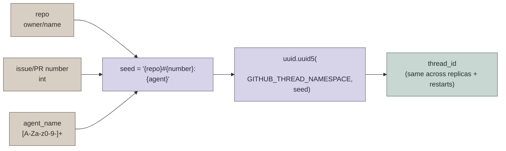
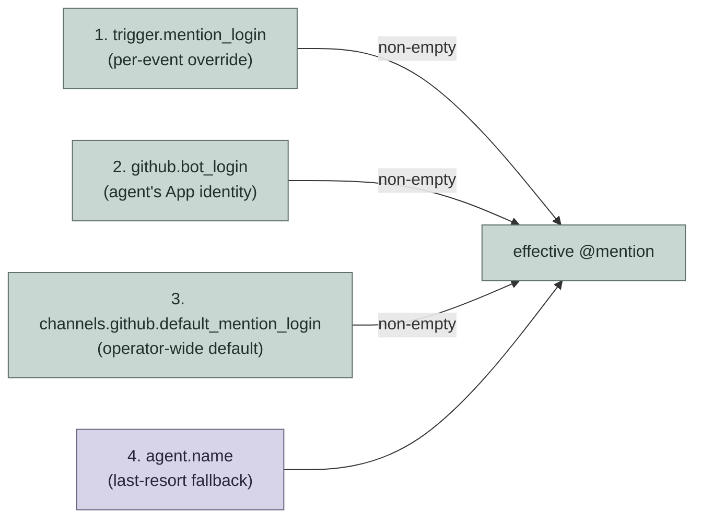
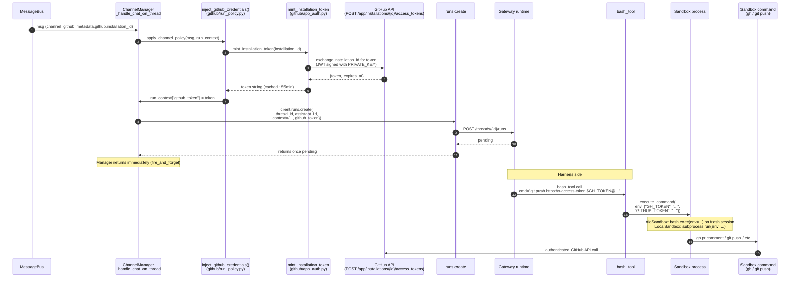
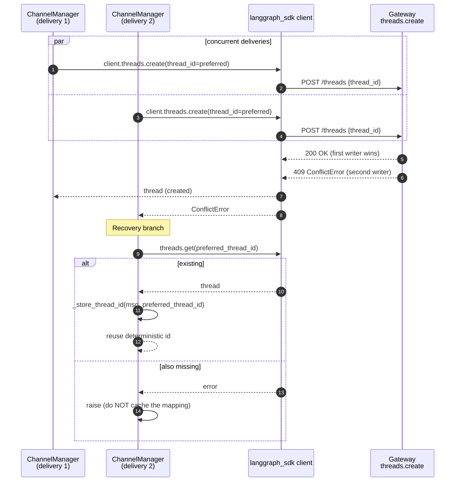
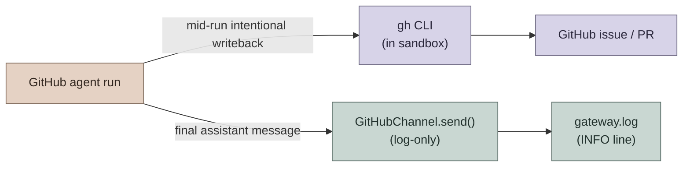

# GitHub Event-Driven Agents

GitHub is a **webhook-push** channel: there is no long-polling worker. Every GitHub App / repository delivery lands at `POST /api/webhooks/github`, where it is HMAC-verified, resolved against trusted agent bindings, and fan-out'd into bounded leased receipt rows. The handler acknowledges only after every matching row commits. Receipt IDs then wake the same `ChannelManager` that handles Feishu/Slack/Telegram. For the high-level orientation, see [AGENTS.md](../AGENTS.md) → "GitHub event-driven agents".

This document covers the **architecture** of that pipeline:

- Per-agent bindings (`config.yaml` → `github:` block)
- Webhook → atomic receipt fan-out → leased dispatch
- HMAC/registry-derived verified route bindings for durable replay
- Mention-handle precedence for `require_mention` triggers
- `preferred_thread_id = UUID5(repo, number, agent_name)` thread determinism
- GH token lifecycle (`GITHUB_APP_ID` + `PRIVATE_KEY` → `run_context["github_token"]` → sandbox `GH_TOKEN`/`GITHUB_TOKEN`)
- `ConflictError` (HTTP 409) thread-create race recovery
- Why **outbound is log-only** (agents post via `gh` from their sandbox)
- Durable FIFO deferral while busy, with process-local buffering retained only for best-effort mode

## Overview

GitHub bindings are declared **per custom agent** in `users/{owner_user_id}/agents/{agent_name}/config.yaml` under a `github:` block. The global `config.yaml` `channels.github` block is intentionally minimal — only the operator kill-switch (`enabled`) and `default_mention_login` live there. Everything that identifies "which agent handles which repo" lives next to the agent that owns it.



Registry cache invalidation uses the configured agent store's opaque signature.
The file backend derives it from agent config mtimes; the database backend uses
a deterministic digest of the stored owner, name, config, and soul, so an update
still invalidates the registry when two writes share the same timestamp.

Each agent binding lists the **events it cares about** under `triggers:`. Events absent from `triggers:` are not delivered to that agent — the dispatcher never loads the agent for them. `DEFAULT_TRIGGERS` only supplies **field-level defaults** (e.g. `require_mention: true`) for events a binding did declare; it is no longer an enablement list.

For the signed production path, `github.installation_id` is also part of the
source trust boundary. The HMAC-authenticated payload's installation must equal
the configured strict positive integer installation before a matching agent can
fire. Quoted, boolean, zero, and negative installation values are invalid; update
legacy YAML to a positive unquoted integer before startup. The dispatcher
then derives one opaque `webhook_route` binding from the provider, installation,
registry owner, canonical agent, and repository. It never uses sender login,
prompt text, or payload metadata as authority, and it leaves
`InboundMessage.connection_id` unset. The binding kind/reference—not a webhook
secret or token—is sealed into Origin and used with workspace/conversation to
scope the stable delivery key. Explicit unverified development mode can still
exercise the channel locally, but it has no verified binding and remains
unkeyed. A signed request without `X-GitHub-Delivery` still receives the verified
route binding but remains unkeyed because it has no provider-stable event identity.
Historical accepted Origins without these optional references remain readable;
connection-backed rows also replay through their original Origin digest because
the new binding reference repeats their already-authenticated `connection_id`.

With PostgreSQL and `dedupe_storage.backend: auto|postgres`, the signed route is
durable at acknowledgment: one receipt is keyed by provider, verified binding
kind/reference, and provider delivery ID. Each row contains only the bounded
normalized launch facts needed for replay. It excludes the HMAC secret, GitHub
token, raw payload, transient attachment bytes, and credentials. SQLite/memory or
explicit `backend: memory` is reported as `best_effort`, not durable ingress.

## Webhook → Fan-out → Dispatch

The webhook handler performs no LangGraph work. It verifies, resolves all trusted
fan-out targets, and atomically stores their receipt rows before returning `200`.
A receipt-store failure returns `503`; because GitHub does not automatically retry
every failed delivery, operators may still need delivery redelivery, but Hartmesh
never acknowledges a delivery whose only copy is the in-memory bus.

```mermaid
sequenceDiagram
    autonumber
    participant GH as GitHub
    participant Router as POST /api/webhooks/github<br/>(github_webhooks.py)
    participant Disp as fanout_event()<br/>(github/dispatcher.py)
    participant Reg as build_github_agent_registry
    participant Trg as event_should_fire
    participant Store as InboundReceiptStore
    participant Bus as MessageBus wake-up
    participant Mgr as ChannelManager
    participant Gateway as Gateway thread API
    participant Runtime as InvocationRuntime

    GH->>Router: delivery (event, delivery_id, payload,<br/>X-Hub-Signature-256, X-GitHub-Event)
    Router->>Router: _verify_signature()<br/>hmac.compare_digest(sha256, secret)
    Router->>Disp: fanout_event(bus, event, delivery_id, payload,<br/>verified_request attestation)
    Disp->>Reg: build_github_agent_registry() (to_thread)
    Reg-->>Disp: agents bound to (repo, event)<br/>with owner + installation
    loop each matched agent
        Disp->>Disp: _is_self_event(sender.login)?
        alt self event
            Disp-->>Disp: skipped (self_event)
        else trigger filter
            Disp->>Trg: event_should_fire(event, payload, trigger, default_mention_login)
            Trg-->>Disp: (fire, reason)
            opt fire
                Disp->>Disp: build_prompt() + resolve_thread_id()<br/>UUID5(repo, number, agent)
                Disp->>Disp: verify payload installation;<br/>derive webhook_route binding
                Disp->>Disp: build bounded immutable receipt envelope
            end
        end
    end
    Disp->>Store: receive_batch(all fired envelopes)
    Store-->>Disp: committed receipt identities
    Disp->>Bus: publish receipt-id wake-ups
    Disp-->>Router: summary {matched, fired, skipped}
    Router-->>GH: 200 OK

    Note over Bus,Gateway: Recovery/consumer side
    Bus->>Mgr: receipt wake-up
    Mgr->>Store: atomically claim with lease + fencing token
    Store-->>Mgr: immutable replay envelope
    Mgr->>Client: client.threads.create(thread_id=preferred_thread_id)
    Client->>Gateway: threads.create (with owner headers)
    Gateway-->>Client: thread_id (or 409)
    Mgr->>Runtime: launch(InternalLaunchIntent)<br/>verified route binding + stable delivery key
    Runtime-->>Mgr: created or known retained run
    Mgr->>Store: bind run_id, then complete (fenced)
    Note over Mgr: Manager returns immediately.<br/>Agent posts to GitHub via gh CLI.
```

## `preferred_thread_id = UUID5(...)` Thread Determinism

`resolve_thread_id(repo, issue_or_pr_number, agent_name)` builds a deterministic LangGraph thread id so a `(repo, PR/issue number)` always lands on the same thread — even after a store wipe, even across gateway replicas (same UUID5 namespace).



Different agents on the same PR (coder + reviewer) **deliberately** get different thread ids — `agent_name` is part of the seed. Sharing a thread would couple their message histories and checkpoints, and `multitask_strategy="reject"` would silently drop one run on every dual-mention. Each agent owns its own thread; cross-agent coordination flows through GitHub (PR comments, review threads), the source of truth humans see.

`ChannelStore` uses `topic_id = f"{number}:{agent_name}"` as its cache key, so each agent's cached mapping is independent — a coder's mapping is invisible to a reviewer on the same PR.

## Mention-handle Precedence

For bindings that declare `require_mention: true` on a given event, the dispatcher must resolve **which** mention login gates the trigger. The precedence chain is:



Whitespace-only values at every level are treated as unset, so the chain falls through cleanly. The `_is_self_event` gate uses the same precedence (with the agent's whole `bindings[*].triggers[*].mention_login` aggregated across all bindings, plus an `agent.name` fallback) so the self-loop gate and the mention gate stay coherent.

## GH Token Lifecycle

GitHub Agents get push/write credentials as **per-call installation tokens**, not as inherited environment. The minted token string is bound into `run_context["github_token"]` on the bus-consumer side and exposed to the agent's sandbox commands as both `GH_TOKEN` and `GITHUB_TOKEN` via per-call `extra_env` on `execute_command`. No `os.environ` mutation, no cross-repo bleed.



Why a string and not a closure: `run_context` is JSON-encoded by the `langgraph_sdk` HTTP client before reaching Gateway. A Python callable does not survive that serialization. The harness side (`_github_env_from_runtime`) already accepts either shape, but only `str` round-trips through the SDK transport.

**Token TTL caveat**: GitHub installation tokens are valid for ~1 hour. Most agent runs finish well inside that window. Truly long coder runs (multi-hour refactors at the higher `recursion_limit=250` ceiling) may see a 401 on a late `git push` / `gh pr create`. Auto-refresh past the 1h TTL is intentionally deferred — it requires registering a token-provider lookup on the harness side, which crosses the harness/app boundary (`tests/test_harness_boundary.py`). Until refresh ships, long runs should finish GitHub writes before expiry or accept the loss. If minting fails (bad App id, wrong installation_id, missing private key), the agent still runs without push/write credentials — read-only is better than no response.

## Thread-create Race Recovery

Two webhook deliveries for the same `(repo, number)` can land within milliseconds of each other and race on `threads.create(thread_id=preferred_thread_id)`. The recovery is narrow by design.



The recovery is **narrow**: only `langgraph_sdk.errors.ConflictError` (HTTP 409) is treated as a concurrent-create collision. Any other failure (transient DB outage, network error, 5xx) propagates so the delivery can fail/retry rather than silently caching `preferred_thread_id` into the store and mapping every future webhook on this issue/PR to a thread that was never created (every later run would 404 forever with no retry path).

The follow-up `threads.get(preferred_thread_id)` is itself verified before caching — if it also rejects, the store underneath is in an inconsistent state and the failure surfaces.

## Busy Follow-ups and Receipt Recovery

A **different** conflict from the one above is a new comment arriving while a run
is active on the same thread. In durable signed-GitHub mode the claimed receipt is
returned to `deferred` with a bounded next-attempt time. It stays in PostgreSQL,
and only the oldest unfinished receipt for that thread is eligible for a claim.
Watcher completion is an early wake-up only; bounded recovery polling is the
process-loss-safe source of progress.

```mermaid
sequenceDiagram
    autonumber
    participant C1 as Comment 1
    participant C2 as Comment 2 (while busy)
    participant Mgr as ChannelManager
    participant Client as langgraph_sdk client
    participant Store as InboundReceiptStore

    C1->>Store: receipt K1 committed and claimed
    Store->>Mgr: immutable delivery K1
    Mgr->>Runtime: launch(K1) [fire_and_forget]
    Runtime-->>Mgr: {run_id: run-1, status: pending}
    Mgr->>SB: subscribe(run-1) (background watcher)

    C2->>Store: receipt K2 committed (same thread_id)
    Store->>Mgr: immutable delivery K2
    Mgr->>Runtime: launch(K2)
    Runtime-->>Mgr: thread-busy ConflictError
    Mgr->>Store: defer K2 with same immutable evidence<br/>and bounded next-attempt time

    Note over Store: run-1 completes; watcher or recovery wakes K2
    Store->>Mgr: claim K2 with a new fencing token
    Mgr->>Runtime: launch(K2)<br/>(C2's binding, Origin, sender, and external key)
    Runtime-->>Mgr: {run_id: run-2, status: pending}
    Mgr->>SB: subscribe(run-2) (watch again — one delivery per chained run)
```

Key properties:

- **Identity snapshot**: each receipt freezes the stable provider ID, verified route binding, sender, owner, chat/topic/workspace route, agent selection, text, and finite policy metadata. Raw provider payloads, attachment bytes, secrets, and credentials are rejected. A previous run never supplies a later delivery's authority, Origin, sender, or key.
- **Dedupe and replay**: receipt acquisition is unique on verified source identity plus provider delivery ID. If a claimant crashes after invocation acceptance but before binding, replay uses the same external key and receives the known equal run; no second graph starts. Different normalized payload under the same receipt identity is an integrity failure.
- **Lease fencing**: every claim increments a fencing token. An expired claim may be reclaimed, and the stale claimant cannot bind, defer, or complete it.
- **FIFO and bounds**: claims select bounded pages and only the earliest unfinished receipt for each thread. Busy work receives exponential bounded retry, a finite attempt cap, and a terminal `dead_letter` outcome rather than a tight loop. Completed receipts have bounded retention cleanup.
- **One source per run**: one receipt launches one invocation on the existing DeerFlow thread. Independent deliveries are never coalesced.
- **Reactions are out of scope.** GitHub's reaction API (`eyes`/`confused` acknowledgment) has no existing integration in this codebase; buffered comments receive no per-comment acknowledgment.
- **Best-effort compatibility**: local/non-PostgreSQL dispatch may still use `ChannelManager._followup_buffers`, capped at 20 and process-local. It is reported as `best_effort`; no deployment claim treats that buffer or `MessageBus` as durable.

## Outbound is Log-only



GitHub agents post to GitHub themselves via the `gh` CLI from inside their sandbox (`gh issue comment`, `gh pr comment`, `gh pr create`, etc.). The channel's `send()` is **log-only** by design — the agent's final assistant message is logged at INFO for visibility but never auto-posted.

Why:

- **Multiple agents can bind the same event.** coder + reviewer on a mention would each auto-post a reply, producing two replies per mention even when only one had useful work. Letting the LLM call `gh` mid-run means silence is just "the LLM did not call `gh`".
- **The agent often wants to post intermediate updates** (an issue comment linking the PR, a sub-issue comment, a PR description edit). The auto-post-the-final-message contract didn't model that and forced the final message to play double duty.
- **The dispatcher's per-agent `_is_self_event` gate** already prevents comments the LLM posts via `gh` from looping the webhook back into a new run for the same agent.

This is also why the GitHub channel registers `ChannelRunPolicy.fire_and_forget=True`: the manager calls `runs.create()` and returns once the run is `pending`, no outbound ferrying, no SDK 300s `httpx.ReadTimeout` on a legitimate long coder run.

## Cross-references

- [AGENTS.md](../AGENTS.md) → "GitHub event-driven agents" — the index view in `backend/AGENTS.md` (binding shape, per-event triggers, mention precedence, token env summary, follow-up buffering summary)
- [IM_CHANNEL_CONNECTIONS.md](IM_CHANNEL_CONNECTIONS.md) — interactive IM channels (Telegram/Slack/etc.) for the full `_handle_chat` and owner-scoped file storage flow
- `app/gateway/github/dispatcher.py` — `fanout_event`, `_is_self_event`, mention precedence chain
- `app/channels/manager.py` — `_buffer_followup`, `_drain_followups_for_thread`, `_watch_run_and_drain_followups` (follow-up buffering while busy, issue #4121)
- `app/gateway/github/identity.py` — `resolve_thread_id` (UUID5), `extract_target`
- `app/gateway/github/triggers.py` — `event_should_fire`, `DEFAULT_TRIGGERS`
- `app/gateway/github/run_policy.py` — `inject_github_credentials`, `register_policy`
- `app/gateway/routers/github_webhooks.py` — HMAC verify, route mount predicate
- `app/channels/github.py` — `GitHubChannel` (log-only outbound)
